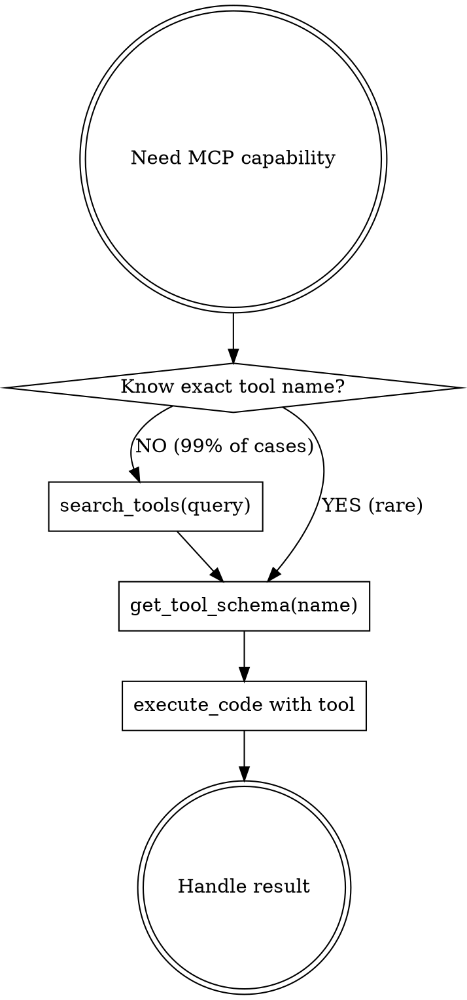

<IMPORTANT>
You have BOTH basic Claude Code tools AND specialized MCP tools via tool-executor.

**Use the right tool for the job:**

| Task | Use This | NOT This |
|------|----------|----------|
| Read a file | `Read` tool | MCP |
| Search for literal string | `Grep` tool | MCP |
| Find files by pattern | `Glob` tool | MCP |
| Run shell commands | `Bash` tool | MCP |
| **Semantic code search** | MCP (Serena) | Grep |
| **Refactor/rename symbols** | MCP (Serena) | Edit |
| **Deep research** | MCP (Gemini) | WebSearch |
| **AI-powered analysis** | MCP (Gemini) | - |
| **Generate images/video** | MCP (Gemini) | - |
| **Library documentation** | MCP (Context7) | WebFetch |
| **Multi-step reasoning** | MCP (Sequential) | - |

**Basic tools are great for basic tasks. MCP is for capabilities that don't exist in basic tools.**
</IMPORTANT>

<EXTREMELY-IMPORTANT>
**When you DO use tool-executor, you MUST follow the workflow.**

You don't know the exact tool names or schemas. You must discover them.

This is not negotiable. This is not optional. You cannot guess your way through MCP.
</EXTREMELY-IMPORTANT>

## The Workflow

**EVERY tool-executor interaction follows this sequence:**

```
1. search_tools(query)     → Find relevant tools
2. get_tool_schema(name)   → Get exact parameters
3. execute_code(code)      → Run the tool
```



## Available MCP Categories

| Category | Server | Capabilities |
|----------|--------|--------------|
| code-nav | Serena (28 tools) | Symbol search, refactoring, code analysis, persistent memory |
| knowledge | Context7, NotebookLM | Library docs lookup, notebook Q&A, research |
| ai-models | Gemini (37 tools) | Deep research, brainstorming, image gen, video gen, structured output |
| reasoning | Sequential-thinking | Multi-step reasoning with thought chains |
| ui | shadcn | Component search, examples, implementation |
| web | Apify | Web scraping, RAG browser, data extraction |

## Red Flags

**When deciding WHETHER to use MCP:**

| Thought | Reality |
|---------|---------|
| "I'll use Serena to read this file" | Just use Read tool. Serena is for semantic search. |
| "I need MCP to search for 'TODO'" | Grep is fine for literal strings. |
| "Let me use Gemini to check the file" | Read it yourself. Gemini is for analysis/research. |

**When you ARE using MCP:**

| Thought | Reality |
|---------|---------|
| "I remember the tool name" | Tool names change. Search first. |
| "I know the schema" | Schemas evolve. Get fresh schema. |
| "Let me just try execute_code" | Without search/schema = guaranteed failure. |
| "I'll console.log the result" | Large outputs truncate. Use workspace. |
| "Let me Read that _savedTo path" | Workspace isn't filesystem. Use workspace.readJSON(). |
| "search_tools is overhead" | search_tools prevents 10x more overhead from failures. |

## Workspace Pattern (CRITICAL)

Large MCP responses are auto-saved to workspace. You receive:

```javascript
{ _savedTo: "mcp-results/123.json", _preview: "..." }
```

**DO NOT** try to `Read("mcp-results/123.json")` - that path doesn't exist on the filesystem!

**DO** use execute_code to access it:

```javascript
const data = await workspace.readJSON("mcp-results/123.json");
console.log(JSON.stringify(data, null, 2));
```

**Best practice** - save your own outputs too:

```javascript
const result = await gemini["gemini-deep-research"]({ query: "..." });
// If result has _savedTo, it's already saved
if (result._savedTo) {
  const full = await workspace.readJSON(result._savedTo);
  // Process full data...
  await workspace.writeJSON("my-analysis.json", processedData);
  console.log("Saved to my-analysis.json");  // Minimal console output
}
```

## Quick Reference

**Use basic tools for:**
- Reading files → `Read`
- Literal text search → `Grep`
- Finding files by name → `Glob`
- Shell commands → `Bash`
- Simple file edits → `Edit`

**Use MCP for (via search_tools first!):**
- "Find where X is defined" → Serena (`find_symbol`)
- "Rename this function everywhere" → Serena (`rename_symbol`)
- "What's the API for library Y?" → Context7 (`query-docs`)
- "Research topic Z thoroughly" → Gemini (`gemini-deep-research`)
- "Help me brainstorm" → Gemini (`gemini-brainstorm`)
- "Analyse this code for issues" → Gemini (`gemini-analyze-code`)
- "Generate an image" → Gemini (`gemini-generate-image`)
- "Help me reason through this" → Sequential-thinking
- "Build a UI component" → shadcn (`search_components`)
- "Scrape data from website" → Apify (`call-actor`)

## Checklist

Before ANY tool-executor usage:

- [ ] Did I search_tools first? (not guess)
- [ ] Did I get_tool_schema? (not assume)
- [ ] Am I saving large outputs to workspace? (not console.log)
- [ ] Am I using workspace.readJSON for _savedTo? (not Read tool)

## The Rule

**search_tools → get_tool_schema → execute_code**

Every. Single. Time.

No exceptions. No shortcuts. No guessing.
