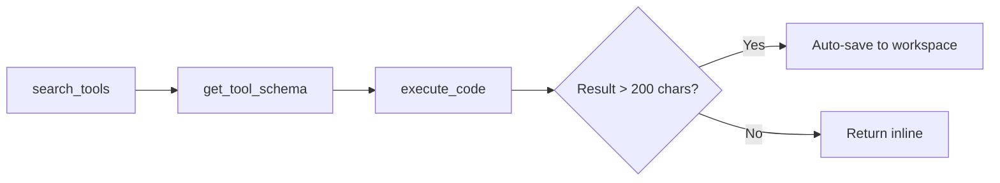

<p align="center">
  
</p>

<p align="center">
  
  
  <a href="https://github.com/aMilkStack/claudikins-tool-executor/commits/main"></a>
  
  
</p>

<h1 align="center">Tool Executor</h1>

<p align="center">
  <strong>Programmatic MCP Execution for Claude Code</strong><br>
  <em>The API has batched tool calling. Claude Code gets serial execution. This bridges the gap.</em>
</p>

<p align="center">
  <a href="#quick-start">Quick Start</a> •
  <a href="#the-3-tool-workflow">The 3-Tool Workflow</a> •
  <a href="#wrapped-servers">Wrapped Servers</a> •
  <a href="#configuration">Configuration</a> •
  <a href="#roadmap">Roadmap</a>
</p>

---

Anthropic's API users get [programmatic tool calling](https://docs.anthropic.com/en/docs/build-with-claude/tool-use) - Claude writes code, executes N tools in a sandbox, returns once. Claude Code users get serial execution and lazy loading. Tool Executor brings the API pattern to Claude Code.

| Aspect | Claude Code (stable) | Claude Code 2.1.7 | Tool Executor |
|--------|---------------------|------------------|---------------|
| **Schema Loading** | All upfront | Lazy (>10% threshold) | Lazy (search on demand) |
| **Execution** | Serial (pause per tool) | Serial (pause per tool) | Batched (N tools, 1 return) |
| **Output Handling** | Dumps to context | Dumps to context | Auto-saves to workspace |
| **Tool Awareness** | All schemas visible | "Search available" | Hook-injected guidance |

**Context savings:** ~97% reduction (48k to 1.1k tokens) for multi-tool workflows.

---

## Quick Start

```bash
# Add the Claudikins marketplace
/marketplace add aMilkStack/claudikins-marketplace

# Install the plugin
/plugin install claudikins-tool-executor
```

Restart Claude Code. Done.

### First Workflow

```
Search for image generation tools, then generate a robot writing documentation.
```

Claude will:
1. Use `search_tools` to find relevant tools
2. Use `get_tool_schema` to load the exact parameters
3. Use `execute_code` to run the generation in one shot

---

## The 3-Tool Workflow

Tool Executor exposes exactly 3 tools. Everything else happens inside the sandbox.



### `search_tools` - Find by Intent

Semantic search across 96 wrapped tools. Serena powers the search with BM25 fallback.

```json
{ "query": "generate images", "limit": 5 }
```

Returns slim results: name, server, 80-char description. No schemas loaded until needed.

### `get_tool_schema` - Load on Demand

Fetch the full JSON Schema for a specific tool before calling it.

```json
{ "name": "gemini_generateContent" }
```

Returns the complete `inputSchema` plus usage examples.

### `execute_code` - Run in Sandbox

TypeScript execution with pre-connected MCP clients. Write code that calls multiple tools, loops, branches - returns once.

```typescript
const result = await gemini["gemini_generateContent"]({
  prompt: "A robot writing documentation",
  aspectRatio: "16:9"
});

// Large responses auto-save to workspace
if (result._savedTo) {
  const full = await workspace.readJSON(result._savedTo);
  console.log("Generated:", full);
}
```

---

## How It Works

```
┌─────────────────────────────────────────────────────────────┐
│                       Claude Code                            │
└─────────────────────────┬───────────────────────────────────┘
                          │ 3 tools (~1.1k tokens)
                          ▼
┌─────────────────────────────────────────────────────────────┐
│                     Tool Executor                            │
│  ┌─────────────┐  ┌──────────────┐  ┌─────────────────┐     │
│  │search_tools │  │get_tool_schema│  │  execute_code   │     │
│  └──────┬──────┘  └──────┬───────┘  └────────┬────────┘     │
│         │                │                    │              │
│         ▼                ▼                    ▼              │
│  ┌──────────────────────────────────────────────────────┐   │
│  │              Registry (96 tool definitions)           │   │
│  │         Serena semantic search + BM25 fallback        │   │
│  └──────────────────────────────────────────────────────┘   │
│                                                              │
│  ┌──────────────────────────────────────────────────────┐   │
│  │                   Sandbox Runtime                     │   │
│  │   • Lazy MCP client connections (pooled)             │   │
│  │   • Auto-save large responses (>200 chars)           │   │
│  │   • TypeScript execution with timeout                │   │
│  └──────────────────────┬───────────────────────────────┘   │
└─────────────────────────┼───────────────────────────────────┘
                          │
        ┌─────────────────┼─────────────────┐
        ▼                 ▼                 ▼
   ┌─────────┐      ┌─────────┐       ┌─────────┐
   │ Gemini  │      │ Serena  │       │  Apify  │  ... (7 servers)
   └─────────┘      └─────────┘       └─────────┘
```

### Session Hooks

Unlike native MCP, Tool Executor injects guidance every session. Claude knows:
- What MCP categories exist (ai-models, code-nav, web, knowledge, reasoning, ui)
- When to use MCP vs basic tools
- The exact search → schema → execute workflow

No guessing. No forgetting.

---

## Workspace Auto-Save

MCP tools often return large payloads. Web scrapes, code analysis, generated content - all eating context.

Tool Executor intercepts responses over 200 characters and saves them to workspace files. Your code receives a reference:

```typescript
const scrapeResult = await apify["apify_scrape"]({ url: "https://example.com" });

// Large response auto-saved
// { _savedTo: "mcp-results/1705312345678.json", _preview: "...", _size: 15234 }

// Read when needed (inside execute_code)
const fullData = await workspace.readJSON(scrapeResult._savedTo);
```

Context stays lean. Data stays accessible.

---

## Wrapped Servers

Pre-configured MCP servers available in the sandbox. These are examples - configure your own.

| Server | Category | Tools | Capabilities |
|--------|----------|-------|--------------|
| `serena` | code-nav | 29 | Semantic code search, symbol references, refactoring (rename/replace), file ops, shell execution, persistent memory, pattern search |
| `gemini` | ai-models | 37 | Deep research agent, Claude+Gemini brainstorming, code analysis, structured output, 4K image gen + multi-turn editing, video gen, TTS, Google search |
| `notebooklm` | knowledge | 16 | Notebook management, Q&A, research, library stats |
| `apify` | web | 7 | Actor-based web scraping, RAG browser, data extraction |
| `shadcn` | ui | 4 | Component search, details, examples |
| `context7` | knowledge | 2 | Library docs lookup, library ID resolution |
| `sequentialThinking` | reasoning | 1 | Multi-step reasoning with thought chains |

**96 tools. 3 exposed. ~97% fewer tokens.**

> **Note:** Serena is required. It powers both `search_tools` discovery AND is available as a full client in the sandbox.

---

## Plugin Structure

<details>
<summary>View directory layout</summary>

```
claudikins-tool-executor/
├── .claude-plugin/
│   ├── plugin.json              # Plugin manifest
│   ├── hooks/
│   │   ├── hooks.json           # Hook definitions
│   │   ├── session-start.sh     # Injects usage guidance
│   │   └── search-tools-activation.sh
│   └── skills/using-tool-executor/
├── dist/                        # Compiled server
├── registry/                    # 96 YAML tool definitions
│   ├── ai-models/gemini/        # 37 tools
│   ├── code-nav/serena/         # 29 tools
│   ├── knowledge/               # context7 (2) + notebooklm (16)
│   ├── reasoning/               # sequentialThinking (1)
│   ├── ui/shadcn/               # 4 tools
│   └── web/apify/               # 7 tools
├── skills/                      # te-guide, te-config, te-doctor
├── commands/                    # Slash commands
├── agents/                      # tool-executor-guide agent
└── workspace/                   # Runtime storage
```

</details>

---

## Configuration

Works out of the box. For custom servers, create `tool-executor.config.json`:

```json
{
  "servers": [
    {
      "name": "myserver",
      "displayName": "My Custom Server",
      "command": "npx",
      "args": ["-y", "my-mcp-package"],
      "env": {
        "API_KEY": "${MY_API_KEY}"
      }
    }
  ]
}
```

<details>
<summary>Environment Variables</summary>

Some bundled servers need API keys:

| Server | Variable | Required |
|--------|----------|----------|
| gemini | `GEMINI_API_KEY` | Yes for Gemini tools |
| apify | `APIFY_TOKEN` | Yes for Apify tools |

Set in Claude Code config (`~/.claude.json`) or shell environment.

</details>

---

## When NOT to Use This

Tool Executor optimises for breadth. Skip it if:

- **1-2 MCP servers only** - overhead isn't worth it
- **Streaming responses needed** - sandbox batches, doesn't stream
- **Production pipelines** - use direct SDK integration
- **Sub-100ms latency required** - sandbox adds startup time

---

## Skills & Commands

**Skills:**
- `/te-guide` - Usage guidance and examples
- `/te-config` - Configuration help
- `/te-doctor` - Diagnose connection issues

**Hooks:**
- `SessionStart` - Injects tool guidance every session
- `UserPromptSubmit` - Activates discovery on relevant prompts

---

## Roadmap

### Immediate

| Feature | Status |
|---------|--------|
| Fluent `.full()` method for `_savedTo` results | Planned |
| Structured preview metadata (type, keys, shape) | Planned |
| Actionable error messages with recovery steps | Planned |

### Short-Term

| Feature | Status |
|---------|--------|
| Pre-indexed vector search (faster startup) | Considering |
| Generated TypeScript definitions for autocomplete | Considering |

### Not Planned

| Feature | Why |
|---------|-----|
| Production API replacement | Out of scope - this is a dev tool |
| Streaming MCP proxy | Complexity vs benefit |
| Universal MCP wrapper | Claude Code-specific by design |

### Community Contributions Welcome

- [ ] Add `LICENSE` file (MIT declared in package.json)
- [ ] Add `examples/` directory
- [ ] Add `CONTRIBUTING.md`
- [ ] Add `CHANGELOG.md`

---

## Part of Claudikins

Tool Executor is one component of the Claudikins ecosystem:

- **Tool Executor** - Programmatic MCP execution (you are here)
- **Automatic Context Manager** - Context handoff automation
- **Klaus** - Debugging with Germanic precision
- **GRFP** - README generation through dual-AI analysis

[View the marketplace](https://github.com/aMilkStack/claudikins-marketplace)

---

## License

[MIT](LICENSE)

---

<p align="center">
  <sub>Built by <a href="https://github.com/aMilkStack">Ethan Lee</a></sub>
</p>
